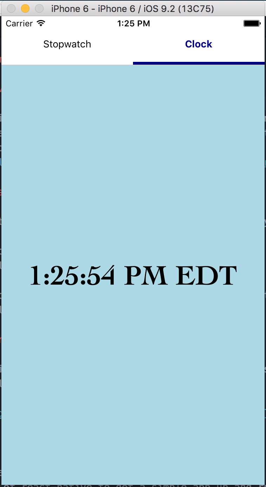

# Simple React-Native Stopwatch
##### James Edwards and Shashwat Chaturvedi

### Overview

Since neither of us had used react-native, and only one of us has any experience with React, we decided to explore creating a simple stopwatch/clock app using react-native.
We set up react-native locally based on this [tutorial](https://github.com/react-community/create-react-native-app).

Clock:

Stopwatch:

### Division of Work

Both partners were present and collaborating for every part of the project.

James focused on setting up the react-native app from the original tutorial, and got a basic hello world program with some styling running.

Shash focused on implementing the timer and styling it, along with setting up the app's scrollable view.

### External Packages

In addition to the default React Native classes, we used an external package for our Scrollable View:

https://github.com/skv-headless/react-native-scrollable-tab-view

### What we Learned

* A refresher/first look at React
* Basics of react-native to get a simple app up and running
* Debugging with xCode's iPhone simulator
* Refresher on collaborating with git

### Issues

* Tried initially to use tutorial [here](https://facebook.github.io/react-native/docs/getting-started.html) but we were unable to get it to work.
* Had problems getting the time to display correctly on the stopwatch.
